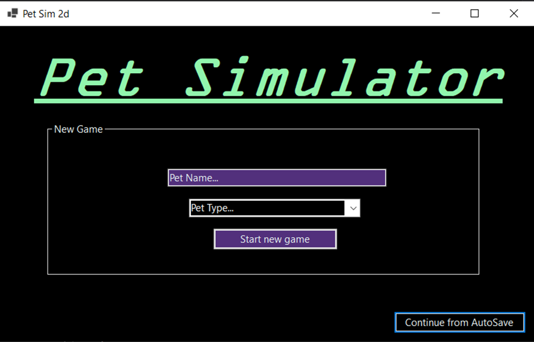

# Pet simulator

## Objects

```c#
using System;
using System.Collections.Generic;
using System.Text;

namespace Tomagtachi
{
    public class pet
    {
        public string name { get; set; }
        public string type { get; set; }
        public int health { get; set; }
        public int happiness { get; set; }
        public int boredom { get; set; }
        public int hunger { get; set; }
        public int sleep { get; set; }
    }

    public class activity
    {
        public string name { get; set; }
        public int healthvaluechange { get; set; }
        public int happinessvaluechange { get; set; }
        public int boredomvaluechange { get; set; }
        public int hungervaluechange { get; set; }
        public int sleepvaluechange { get; set; }
     
    }
}
```


## Methods

```c#
using System;
using System.Collections.Generic;
using System.IO;
using System.Text;

namespace Tomagtachi
{
    public class methods
    {
        public static pet newpet(string name, string type,int health, int happiness, int bordem, int hunger, int sleep)
        {
            pet tomogachi = new pet();
            {
                tomogachi.name = name;
                tomogachi.type = type;
                tomogachi.health = health;
                tomogachi.happiness = happiness;
                tomogachi.boredom = bordem;
                tomogachi.hunger = hunger;
                tomogachi.sleep = sleep;
                
            }
            return tomogachi;
        }
        public static activity newactivity(string name, int health, int happiness, int boredom, int hunger, int sleep)
        {
            activity action = new activity();
            {
                action.name = name;
                action.healthvaluechange = health;
                action.happinessvaluechange = happiness;
                action.boredomvaluechange = boredom;
                action.hungervaluechange = hunger;
                action.sleepvaluechange = sleep;
                return action;
            }
        }
        public static void uploaddeadpet(pet tomagathci)
        {
            using (System.IO.StreamWriter file = new System.IO.StreamWriter(@"C:\Users\vivek\Documents\Vs Projects\Tomogatchi\Tomagtachi\Tomagtachi\Properties\Past pets.txt", true))
            {
                file.WriteLine(tomagathci.name + "," + tomagathci.type + "," + tomagathci.health + "," + tomagathci.happiness + "," + tomagathci.boredom + "," + tomagathci.hunger + "," + tomagathci.sleep);
                file.Close();

            }

        }
        public static void savepet(pet tomogatchi)
        {
            using (System.IO.StreamWriter file = new System.IO.StreamWriter(@"C:\Users\vivek\Documents\Vs Projects\Tomogatchi\Tomagtachi\Tomagtachi\Properties\current pet.txt"))
            {
                file.WriteLine(tomogatchi.name + "," + tomogatchi.type + "," + tomogatchi.health + "," + tomogatchi.happiness + "," + tomogatchi.boredom + "," + tomogatchi.hunger + "," + tomogatchi.sleep);
                file.Close();
            }
        }

        public static void pettimedamadge(pet tomogatchi)
        {
            tomogatchi.health += -1; tomogatchi.happiness += -1; tomogatchi.boredom += -1; tomogatchi.hunger += -1; tomogatchi.sleep += -1; savepet(tomogatchi);
        }

        public static void activitystatsupdate(pet tomogatchi, activity act)
        {
            tomogatchi.health += act.healthvaluechange; tomogatchi.happiness += act.happinessvaluechange; tomogatchi.boredom += act.boredomvaluechange; tomogatchi.hunger += act.hungervaluechange; tomogatchi.sleep += act.sleepvaluechange; savepet(tomogatchi);
        }

        public static Boolean petdead(pet tomogatchi)
        {
            if(tomogatchi.health <= 0 | tomogatchi.happiness <= 0 | tomogatchi.boredom <= 0 | tomogatchi.hunger <= 0 | tomogatchi.sleep <= 0)
                {
                uploaddeadpet(tomogatchi);
                return true;
                }
            else return false;
        }
        public static pet returnpet()
        {
            using (System.IO.StreamReader file = new System.IO.StreamReader(@"C:\Users\vivek\Documents\Vs Projects\Tomogatchi\Tomagtachi\Tomagtachi\Properties\current pet.txt"))
            {
                var line = file.ReadLine();
                var values = line.Split(',');
                file.Close();
                return newpet(values[0], values[1], Int32.Parse(values[2]), Int32.Parse(values[3]), Int32.Parse(values[4]), Int32.Parse(values[5]), Int32.Parse(values[6]));
            }
        }
        public static void revieve() 
        {
            activity dogreborn = methods.newactivity("dog", 50, 50, 50, 50, 50);
            activity catreborn = methods.newactivity("cat", 35, 35, 60, 60, 60);
            activity fishreborn = methods.newactivity("fish", 35, 35, 60, 60, 60);
            activity snakereborn = methods.newactivity("snake", 55, 55, 30, 55, 55);
            pet revieved = returnpet();

            switch (revieved.type) 
            {
                case "Dog":
                    activitystatsupdate(revieved, dogreborn);
                    break;
                case "Cat":
                    activitystatsupdate(revieved, catreborn);
                    break;
                case "Fish":
                    activitystatsupdate(revieved, fishreborn);
                    break;
                case "Snake":
                    activitystatsupdate(revieved, snakereborn);
                    break;
            }
        }
        public static int updaterandom(int linecount)
        {
            Random Rnd = new Random();
            int pickedquestion = Rnd.Next(linecount);
            return pickedquestion;
        }

        public static List<string> getwords()
        {
            //importing words and hints
            using (var reader = new StreamReader(@"C:\Users\vivek\Documents\Vs Projects\Tomogatchi - Copy\Tomagtachi\Tomagtachi\Properties\finalwordsandhints.txt"))
            {
                List<string> Word = new List<string>();

                while (!reader.EndOfStream)
                {
                    var line = reader.ReadLine();
                    var values = line.Split('|');

                    Word.Add(values[0]); ;
                }
                return Word;
            }

        }
        public static List<string> gethints()
        {
            //importing words and hints
            using (var reader = new StreamReader(@"C:\Users\vivek\Documents\Vs Projects\Tomogatchi - Copy\Tomagtachi\Tomagtachi\Properties\finalwordsandhints.txt"))
            {
                List<string> Hint = new List<string>();

                while (!reader.EndOfStream)
                {
                    var line = reader.ReadLine();
                    var values = line.Split('|');

                    Hint.Add(values[1]);
                }
                return Hint;
            }

        }

        public static int linecount()
        {
            //getting line count
            List<string> Word = getwords();
            int linecount = 0;
            foreach (var value in Word)
            {
                linecount++;
            }
            return linecount;
        }
    }
}

```


## Loading Screen

### UI Screenshots




### Code

```c#
using System;
using System.Collections.Generic;
using System.ComponentModel;
using System.Data;
using System.Drawing;
using System.Linq;
using System.Text;
using System.Threading.Tasks;
using System.Windows.Forms;

namespace Tomagtachi
{
    public partial class Form1 : Form
    {

        //public pet actualpet = methods.newpet("", "", 0, 0, 0, 0, 0);
        
        public Form1()
        {
            InitializeComponent();
        }
       
        private void Form1_Load(object sender, EventArgs e)
        {
           
        }
        private void button1_Click(object sender, EventArgs e)

        {
            try
            {
                switch (comboBox1.SelectedItem.ToString())
                {
                    case "Dog":
                        pet Dog = methods.newpet(textBox1.Text, "Dog", 0, 0, 0, 0, 0);
                        activity dogborn = methods.newactivity("dog", 50, 50, 50, 50, 50);
                        methods.activitystatsupdate(Dog, dogborn);
                        methods.savepet(Dog);
                        break;
                    case "Cat":
                        pet Cat = methods.newpet(textBox1.Text, "Cat", 0, 0, 0, 0, 0);
                        activity catborn = methods.newactivity("cat", 35, 35, 60, 60, 60);
                        methods.activitystatsupdate(Cat, catborn);
                        methods.savepet(Cat);
                        break;
                    case "Fish":
                        pet Fish = methods.newpet(textBox1.Text,"Fish", 0, 0, 0, 0, 0);
                        activity fishborn = methods.newactivity("fish", 35, 35, 60, 60, 60);
                        methods.activitystatsupdate(Fish, fishborn);
                        methods.savepet(Fish);
                        break;
                    case "Snake":
                        pet snake = methods.newpet(textBox1.Text,"Snake", 0, 0, 0, 0, 0);
                        activity snakeborn = methods.newactivity("snake", 55, 55, 30, 55, 55);
                        methods.activitystatsupdate(snake, snakeborn);
                        methods.savepet(snake);
                        break;
                    default:
                        //MessageBox.Show("test");
                        break;
                }
                Form2 form2 = new Form2();
                form2.Show();
                //this.Hide();
            }
            catch { MessageBox.Show("Well Done idiot you forgot to select the type of pet from the drop down list"); }
        }
        private void button2_Click(object sender, EventArgs e)
        {
            if (methods.petdead(methods.returnpet()) == false) { Form2 form2 = new Form2(); form2.Show(); } else { MessageBox.Show("No vaild saves"); }
        }
    }
}

```

## Main Game Screen:

### Screenshots:

screen shots are introduced by pet type (Selected in the first form). Each pet has a different combination of stats and a different avatar.

#### Dog:


#### Cat:


#### Fish:


#### Snake:


### Code

```c#
using System;
using System.Collections.Generic;
using System.ComponentModel;
using System.Data;
using System.Drawing;
using System.Text;
using System.Windows.Forms;


namespace Tomagtachi
{
    public partial class Form2 : Form
    {
        private pet actualpet = methods.returnpet();
        private activity sleep = methods.newactivity("sleep", 2, 3, -5, -12, 12);
        private activity eat = methods.newactivity("eat", 8, -4, -8, 8, -4);
        private activity play = methods.newactivity("sleep", 5, 5, 5, -8, -9);
        private activity party = methods.newactivity("Party", -4, 8, 8, -8, -4);


        Timer GameTimer = new Timer();
        Timer TimeDamadger = new Timer();
        public Form2()
        {
            InitializeComponent();
        }

        private void Form2_Load(object sender, EventArgs e)
        {
            TimeDamadger.Interval = 5000;
            TimeDamadger.Tick += new EventHandler(TimeDamadger_Tick);
            TimeDamadger.Start();
            GameTimer.Interval = 5;
            GameTimer.Tick += new EventHandler(checkdead_Tick);
            GameTimer.Start();
            methods.savepet(actualpet);
            switch (actualpet.type)
            {
                case "Dog":
                    pictureBox1.Image = Properties.Resources.Dog;
                    break;
                case "Cat":
                    pictureBox1.Image = Properties.Resources.Cat;
                    break;
                case "Fish":
                    pictureBox1.Image = Properties.Resources.Fish;
                    break;
                case "Snake":
                    pictureBox1.Image = Properties.Resources.Snake;
                    break;
            }
        }
        private void checkdead_Tick(object sender, EventArgs e)
        {
            label6.Text = (actualpet.name);
            label7.Text = ("type: " + actualpet.type);
            label1.Text = ("health: " + actualpet.health);
            label2.Text = ("happiness: " + actualpet.happiness);
            label3.Text = ("boredom: " + actualpet.boredom);
            label4.Text = ("hunger: " + actualpet.hunger);
            label5.Text = ("sleep: " + actualpet.sleep);
            methods.savepet(actualpet);
            if (methods.petdead(methods.returnpet()) == false) { }
            else { GameTimer.Stop(); TimeDamadger.Stop(); Gameover(); }
        }
        private void TimeDamadger_Tick(object sender, EventArgs e)
        {
            methods.savepet(actualpet);
            if (methods.petdead(methods.returnpet()) == false) { methods.pettimedamadge(actualpet); actualpet = methods.returnpet(); }
            else { GameTimer.Stop(); TimeDamadger.Stop(); Gameover(); }
        }
        private void button1_Click(object sender, EventArgs e)
        {
            methods.activitystatsupdate(actualpet, sleep);
            actualpet = methods.returnpet();
        }

        private void button2_Click_1(object sender, EventArgs e)
        {
            methods.activitystatsupdate(actualpet, eat);
            actualpet = methods.returnpet();
        }

        private void button3_Click(object sender, EventArgs e)
        {
            methods.activitystatsupdate(actualpet, play);
            actualpet = methods.returnpet();
        }

        private void button4_Click(object sender, EventArgs e)
        {
            methods.activitystatsupdate(actualpet, party);
            actualpet = methods.returnpet();
        }

        private void Gameover()
        {
            DialogResult wantrevieve = MessageBox.Show("Your pet has died of negligence. Do you want to revieve it?", "Game Over", MessageBoxButtons.YesNo);
            if (wantrevieve == DialogResult.Yes) { Game minigame = new Game(); minigame.Show();  }
            else { MessageBox.Show("GG", "Game Over", MessageBoxButtons.OK); }
        }
    }
}
```

## Minigame:

### Screenshots


### Code

```c#
using System;
using System.Collections.Generic;
using System.Windows.Forms;

namespace Tomagtachi
{
    public partial class Game : Form
    {
        public Game()
        {
            InitializeComponent();
        }
        public static int pickquestion()
        {
          
           int pickedquestion = methods.updaterandom(methods.linecount());
           return pickedquestion;
        }
        public static int pickedquestion = pickquestion();
        static methods get = new methods();
        public static List<string> Word = methods.getwords();
        public static List<string> Hint = methods.gethints();
        public int iterate = 0;
        public int correctguessnum = 0;
        public int points = 0;
        public int lives = 10;
        public string answer = Word[pickedquestion].ToLower();
        public string hint = Hint[pickedquestion];

        private void Game_Load(object sender, EventArgs e)
        {
            
            WriteHint.Text = ("Hint:" + hint);
            WritePoints.Text = ("Points: " + points.ToString());
            WriteLives.Text = ("Lives: " + lives.ToString());
        }

        private void textBox1_TextChanged(object sender, EventArgs e)
        { }

        private void button1_Click_1(object sender, EventArgs e)
        {
            string UserGuess = textBox1.Text.ToLower();
            if (UserGuess != answer)
            {
                lives = lives - 1;
                iterate++;
                WriteLives.Text = (lives.ToString());
                if (lives == 0)
                {
                    string message0 = ("Well Done! You have Scored " + points);
                    string title0 = ("Game Over");
                    MessageBox.Show(message0, title0);
                }
                else
                {

                    string message = ("Incorrect please try again. You have " + lives.ToString() + " guesses remaining");
                    string title = ("bad luck");
                    MessageBox.Show(message, title);


                }
            }
            else
            // if the user is correct
            {
                iterate++;
                correctguessnum++;
                points = points + (10 - iterate);
                WritePoints.Text = (points.ToString());
                string Message = (" well done! you got it right. It took you " + iterate + " attempts. You have scored " + correctguessnum + " question(s) correctls and have " + points + " points");
                String Title = ("Well Done!");
                MessageBox.Show(Message, Title);
                iterate = 0;
                pickedquestion = pickquestion();
                answer = Word[pickedquestion].ToLower();
                hint = Hint[pickedquestion];
                WriteHint.Text = (hint);
                WritePoints.Text = (points.ToString());
                WriteLives.Text = (lives.ToString());
                if (points == 3) 
                {
                    methods.revieve();
                    //this.Close();
                }

            }

        }
    }
}
```

